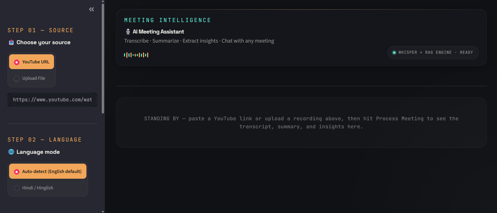
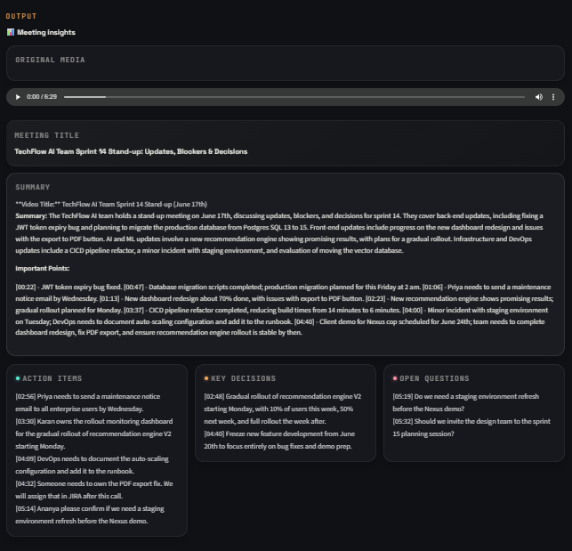
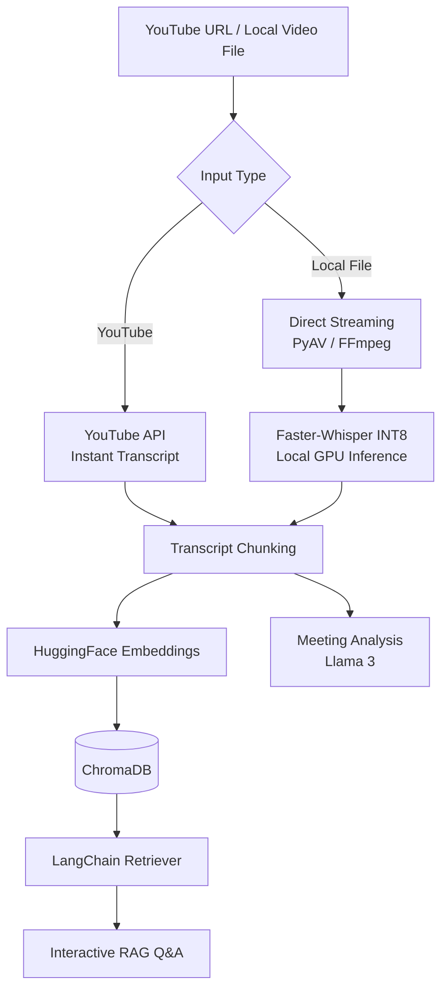

# 🎙️ AI Video & Meeting Assistant

[](https://www.python.org/downloads/)
[](https://opensource.org/licenses/MIT)
[]()

A fully local AI meeting assistant that converts videos into semantic meeting insights with RAG, Whisper, LangChain, and Llama 3.

---

## 💡 Why This Matters

Most meeting assistants rely on cloud APIs. This project explores a local-first architecture for:
- **Privacy-first AI** for sensitive, offline meeting intelligence.
- **Local inference optimization** tailored for consumer hardware.
- **Temporal-aware RAG** to solve the limitations of dense vector retrieval.

The system is optimized for speed while preserving high-quality transcript understanding and chronological reasoning.

---

## 📸 Demo & UI

Features a stunning **glassmorphism** design with custom CSS, providing a premium SaaS feel. 

<div align="center">
  
  
  
</div>

---

## ✨ Core Features

* **🎥 Media Processing:** Supports YouTube URLs and raw local files (`.mkv`, `.mp4`). Streams natively via PyAV, bypassing intermediate `.wav` conversions.
* **⚡ Accelerated Speech-to-Text:** Uses `faster-whisper` (CTranslate2) for local GPU transcription. Injects `[MM:SS]` timestamps for accurate temporal context.
* **🧠 Context-Aware Analysis:** Uses Llama 3 (via Ollama) to automatically generate meeting titles, summaries, action items, and decisions. Users can also inject custom context to help the LLM resolve acronyms.
* **🔍 Semantic RAG:** Splits transcripts into chunks, generates HuggingFace embeddings, and stores them in ChromaDB. Features Conversational Memory to answer follow-up queries interactively.

## 💬 Example Queries

- "What action items were assigned?"
- "What happened at the 12:45 mark?"
- "Summarize the discussion about deployment."
- "Which decisions were finalized?"
- "What blockers were mentioned?"

---

## 🚀 Our Optimization & Experimentation Journey

1. **Terminal to Web UI (and back):** We initially built a terminal CLI. Realizing that insights needed a visual dashboard, we migrated to **Streamlit**, redesigning the UI with a custom sleek, dark-mode glassmorphism interface. We ultimately preserved the CLI (`main.py`) for headless execution.
2. **The 54-minute to 2-minute Transcription Jump:** Our initial pipeline used standard `whisper` and `pydub`, taking 54 minutes for a 22-minute video. Switching to `faster-whisper` (int8) and native audio streaming dropped this to ~2 minutes.
3. **Whisper Tradeoffs (Base vs. Tiny):** We experimented with `base` vs `tiny` models. We found that `tiny` with `int8` quantization offered the perfect sweet spot for consumer GPUs: blazing fast processing with accuracy that was still sufficient for the LLM to understand the core context.
4. **Offline LLM Experimentation (Mistral vs. Llama 3):** To make the app fully local, we tested models via Ollama. We found that **Llama 3 (8B)** was significantly faster and more reliable at adhering to structured JSON-like extraction prompts than Mistral.
5. **Fixing the "Timestamp Wipe":** We discovered the LLM was completely blind to time. We explicitly injected `[MM:SS]` formatting natively into both the YouTube API fetcher and the Whisper fallback, instantly allowing the LLM to answer queries like "What was said at the 1:01 mark?".
6. **Combating Cultural Hallucinations:** When testing a Hindi video, the AI mistakenly thought a cultural greeting was a person's name. By explicitly forcing the LLM to use the YouTube metadata (Title, Description) as context, we eliminated this hallucination entirely.
7. **Solving the "Chronological RAG" Problem:** Semantic search (dense vector retrieval) is notoriously bad at temporal queries (e.g., "what happened at 2 minutes?") because numbers lack strict semantic correlation. We implemented a dynamic regex-based "time-slicer" that intercepts chronological queries, bypasses the RAG database entirely, and extracts a dynamic reading window (±30s to ±120s based on total video length) directly from the raw transcript. To aggressively test this, we performed a blind evaluation:
   
   **Evaluation Set:**
   - 40 manually verified QA pairs
   - 10 timestamp-based retrieval queries
   - 30 semantic understanding queries

   This rigorous evaluation verified our custom time-slicer boosted chronological extraction to a perfect 10/10 while the overall system maintained an 87.5% semantic accuracy score (graded via manual scoring against the ground-truth hidden script).

---

## 📊 Benchmarks

| Pipeline | 22-min Video Processing Time |
|----------|------------------------------|
| Standard OpenAI Whisper (`large-v2`) | ~ 54 minutes |
| **Faster-Whisper (`tiny`, INT8)** | **~ 2 minutes** |

*(Note: Of the final 2 minutes, the actual GPU transcription takes barely 60 seconds; the remainder is generation time for the Llama 3 summaries and insights.)*

Benchmarks recorded on:
- **Nvidia A2000 GPU**
- **CUDA 12**
- **Whisper tiny INT8**

---

## 🛠️ Tech Stack

| Category         | Technologies                      |
| ---------------- | --------------------------------- |
| UI               | Streamlit, Custom CSS             |
| Speech-to-Text   | Faster-Whisper, YouTube API       |
| LLM & RAG        | Llama 3 (Ollama), LangChain       |
| Vector Database  | ChromaDB                          |
| Embeddings       | HuggingFace Sentence Transformers |
| Media Decoding   | PyAV, FFmpeg                      |

---

## 📁 Repository Structure

```text
app.py          # Streamlit web application
main.py         # Interactive terminal CLI
core/           # RAG, LLM, Extractor, and Summarizer logic
utils/          # Helper utilities
```

---

## ⚡ Quick Start

```bash
git clone <repo-url>
cd <repo-name>

pip install -r requirements.txt

ollama run llama3

streamlit run app.py
```

---

## 🚀 Setup

### Prerequisites
* Python 3.10+
* FFmpeg installed and available in your system PATH
* A CUDA-compatible NVIDIA GPU (required for accelerated inference)
* [Ollama](https://ollama.com/) installed with the Llama 3 model (`ollama run llama3`)

Create a `.env` file:
```env
WHISPER_MODEL="tiny"
```

### Install Dependencies
```bash
pip install -r requirements.txt
```

---

## 💻 Usage

### Web Application (Recommended)
Launch the beautifully redesigned web application:
```bash
streamlit run app.py
```

### Terminal CLI
If you prefer an interactive terminal experience:
```bash
python main.py
```

---

## 🧩 Architecture Highlights

- **Hybrid transcript pipeline:**
  - Instant YouTube transcript retrieval when available
  - Faster-Whisper fallback for local transcription
- **Temporal-aware transcript formatting:**
  - Explicit `[MM:SS]` injection for timestamp reasoning
- **Fully local RAG stack:**
  - HuggingFace embeddings
  - ChromaDB vector storage
  - LangChain retriever orchestration
- **Local-first inference:**
  - Ollama-hosted Llama 3 for private meeting analysis

## 🧠 System Architecture



---

## ⚠️ Known Limitations
- **Multi-lingual / Hinglish Accuracy:** To achieve the blazing-fast 2-minute processing time, this project uses the Whisper `tiny` model. While it performs exceptionally well on English, accuracy degrades slightly on mixed languages like Hinglish. This can be easily resolved by swapping the `.env` variable to `base` or `small` if you have more VRAM!
- **Processing Time vs. Privacy Tradeoff:** Running LLMs and transcription models completely locally ensures 100% data privacy and absolute authority over your data (perfect for sensitive corporate meetings). However, this naturally means generation times are slower on consumer laptops compared to querying massive enterprise cloud APIs.

---

## 🚀 Future Improvements
- Speaker diarization
- Multi-user collaboration
- PDF export
- Live meeting transcription
- Docker deployment
- Cloud vector sync

---

## 📄 License
Distributed under the MIT License. See `LICENSE` for more information.
